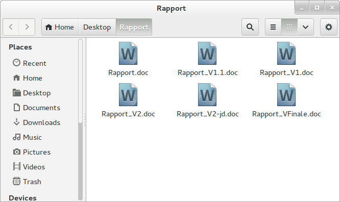
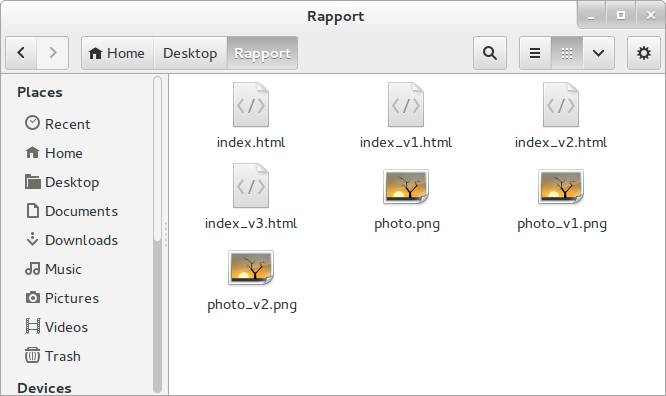
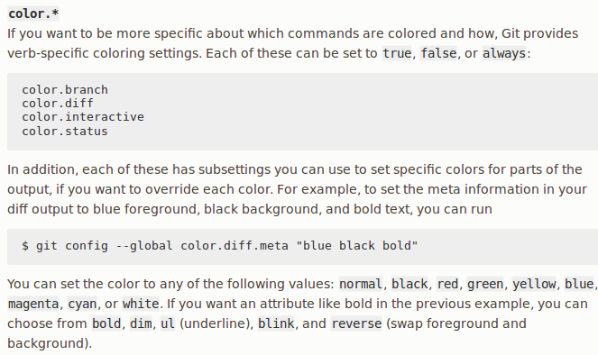

<style>
section { font-size: 22pt; }
h1 { font-size: 1.6em; margin:0 0; padding:0 0; }
h2 { font-size: 1.4em; margin:0 0; padding:0 0; }
h3 { font-size: 1.2em; margin:0 0; padding:0 0; }
</style>


# 1. Problème



---

# 2. Problème


---

# 2bis. Problèmes combinés

À partir de ces documents donc, d'après vous, quels besoins éprouvent les utilisateur-rice-s ?



---

# 3. Problème(s)

- À partir de ces documents, les besoins éprouvés peuvent être :
	- Comprendre les versions
	- Pouvoir revenir en arrière, avoir une "trace"
	- Pouvoir avoir une collaboration simple

---

# 4. Git : un outil de versionnage

- Date d'avril 2005, créé par le créateur du noyau Linux Linus Torvalds et par Junio Hamano
- Sous licence libre GNU GPLv2
- Version 2 actuellement
- Autres outils : 
	- connus : CVS, SVN (Subversion)  
	- moins connus : Mercurial, Bazaar

---

# 5. Git : Principes généraux

- Travail dans un *repository* (dépôt en français) == un dossier
	- Il contient un dossier (souvent caché) `.git` qui contient toutes les archives enregistrées
- Contrairement à Dropbox ou Google Drive, pour qu'une modification soit archivée, il faut que cela soit explicité
	- Ces modifications archivées sont appelées "commit"
	- Elles portent un message enregistré par l'utilisateur
	- Elles peuvent comporter plusieurs fichiers
	- Les fichiers qui ont subi des modifications doivent y être ajoutés explicitement

---

# 6. Git : Principes généraux

On distingue trois "états" des fichiers

- un état de travail : le fichier a subi des modifications, mais nous ne l'avons pas encore ajouté (`add`) à un futur commit
- un état de futur enregistrement : le fichier a été ajouté (`add`) à un commit, mais le commit n'a pas été finalisé avec un message
	- Appelée *staging area*, ou *stage*
- un état archivé : le fichier a subi des modifications enregistrées et n'a pas été modifié depuis lors.


---

# 7. Git : Commandes principales

- **Initialisation** : `git init`
- **Ajout de modifications** : `git add [Nom du fichier]` ou `git add -A` (Ajout de tous les fichiers changés)
- **État du dépôt** : `git status` (donne la liste des modifications réalisées)
- **Enregistrement de modifications** : `git commit -m "Message du commit"`. N'oubliez jamais le -m à moins de vouloir passer un mauvais moment.
- **Historique du repository** : `git log`
- **Différence entre l'état archivé et l'état actuel** : `git diff` pour une différence détaillée, `git status` pour un point général.

---

# 8. Changer les couleurs si difficiles à lire



---

# 9. Importance des messages


---

# 10. Formats "compilés" / "compressés"

https://ponteineptique.github.io/cours-git/cours-1/images/blanc.png 
https://ponteineptique.github.io/cours-git/cours-1/images/blanc2.png 


---

# 11. Précisions techniques

Contrairement à ce que l'on pourrait penser, Git n'archive ou ne sauvegarde pas vos fichiers. Ce qu'il sauvegarde, ce sont les modifications apportées à des fichiers. Par exemple, si je crée un fichier toto.txt qui contient "toto" en ligne 1, il enregistrera:

```
-> Nouveau(toto.txt)
-> Content(toto.txt, "toto")
```

Si ensuite, j'ajoute une nouvelle ligne:

```
-> Content(toto.txt, "\nune nouvelle ligne")
```

Où `\n` est un retour à la ligne.


---

# Crédits

- Images "Motivation" issues de [Introduction à Git](http://liris.cnrs.fr/~pchampin/enseignement/intro-git/) sous licence `CC BY SA 3.0`
- Image "Stage" issue de https://git-scm.com/about/staging-area