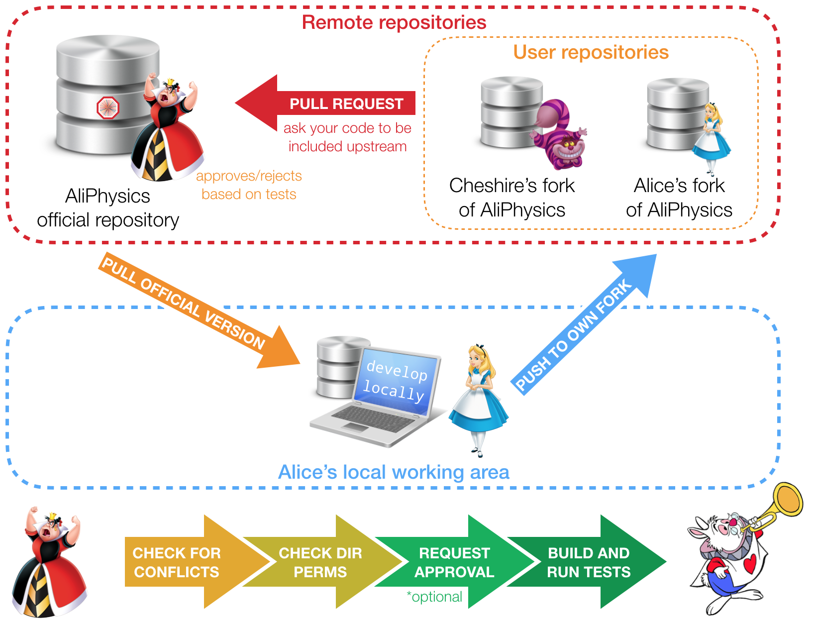

# 1. Ce qu'il manque jusque là

- Capacité de sauvegarde distance : dois-je faire une copie dans ma dropbox ?
- Capacité de travailler en équipe : dois-je faire un git dans ma dropbox et partager le dossier ?
- etc.

---

# 2. Git et ses services en ligne

Des entreprises et des structures du public fournissent des serveurs centralisés pour git :

- [Github](https://github.com) qui est le plus à la mode et que nous utiliserons
- [Gitlab](https://gitlab.com) qui est le concurrent le plus sérieux de github aujourd'hui
- [Bitbucket](https://bitbucket.org)
- [Forge](https://forge.git.cnrs.fr) pour le CNRS

---

# 3. Un dessin vaut mieux qu'une explication

---

# 4. Le vocabulaire des serveurs distants pour Git

- *Remote* : Serveur distant permettant la synchronisation manuelle de votre dépôt
- *origin* : Nom du serveur principal, un peu comme master est la branche principale. Pour l'instant, nos serveurs n'en ont pas
- *push* : Envoyez les modifications effectuées sur un serveur donné.
- *pull* : Retrouvez les informations depuis un serveur donné
- *clone* : Copie sur votre PC d'un dépôt trouvé en ligne
- *fork* : dérivé d'un dépôt d'un-e autre développeur-se
- *upstream* : Par convention, nom d'un second serveur, généralement le serveur source du *fork*

---

# 5. Créons un compte Github 

- Github a des défauts (pas open source par exemple) mais reste l'outil le plus moderne pour de la gestion de code versionné en équipe
- Github propose un environnement complet
	- Gestion d'équipe
	- Connexions à d'autres applications
	- Gestion de ticket
	- Gestion de fusion de branches
	- etc.

---

# 6. Ajoutons nos notes de cours en ligne

1. Créer un repo "notes-de-cours"
	- **/!\ Surtout ne pas cocher initialiser le repository**
		- Pourquoi ?
2. Ajouter ce serveur à votre dépôt local
	- `git remote add origin [adresse du serveur]`
3. Pour le premier push de synchronisation
	- `git push -u origin master`
		- Git, envoie ma branche actuelle sur la branche master du serveur origin. (-u:) Cette branche correspondra à partir de maintenant à celle sur mon dépôt local
	- `git push` sera suffisant (pour la branche master !) à partir de maintenant.

---

# 7. Cloner un repository

Un dépôt git en ligne est peu ou prou la même chose qu'un dépôt git local sauf que vous ne pouvez pas commit directement dessus. Il s'agit de l'archive ".git" de votre dépôt avec la capacité de se connecter et de synchroniser ces informations. 

Tous les dépôts git ne sont **pas disponible en écriture**. Il se peut qu'un repository git distant soit protégé pour n'être complété que par tel groupe de personne.

Cependant, cela n'empêche pas de les **cloner** et de travailler dessus localement. Vous ne pourrez juste pas modifier le Git distant (remote)

> [https://github.com/ponteineptique/cours-git](https://github.com/ponteineptique/cours-git)

---

# 8. Bonnes pratiques...

... quand on travaille avec plusieurs postes avec un dépôt distant

- Toujours faire un git status en se connectant sur son dossier
- Suivi d'un `git pull` si vous avez travaillé dessus depuis un autre poste ou depuis votre PC
- Essayez le plus possible de ne pas travailler dans la master mais dans des branches focalisées sur un objectif dès que votre projet commence à grossir
