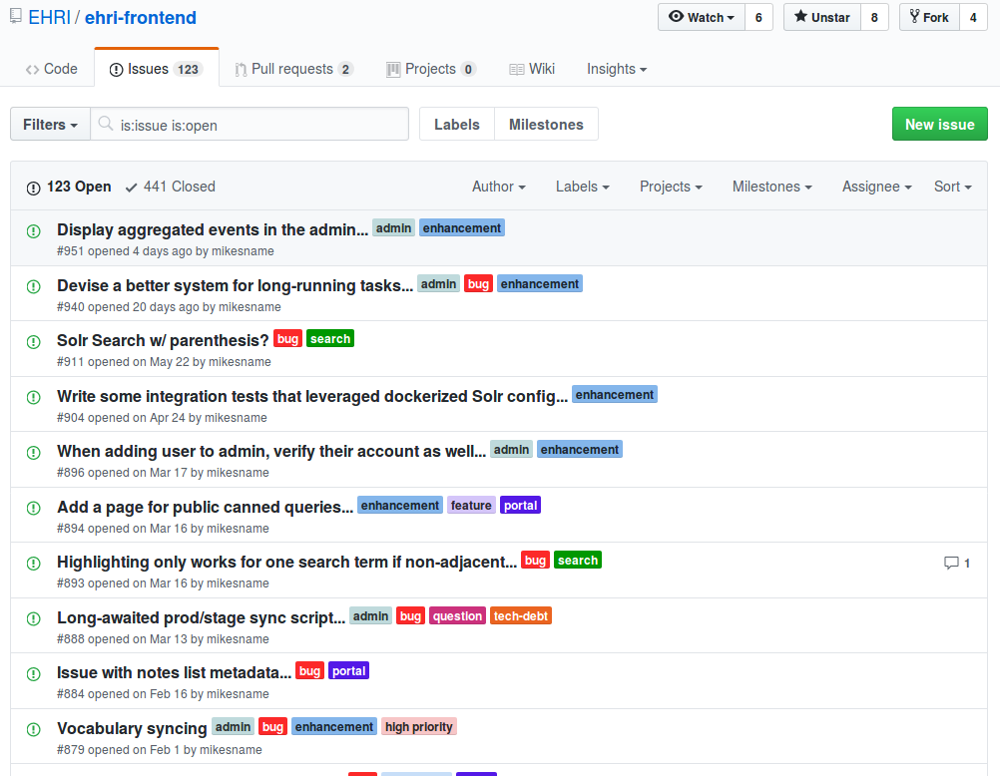
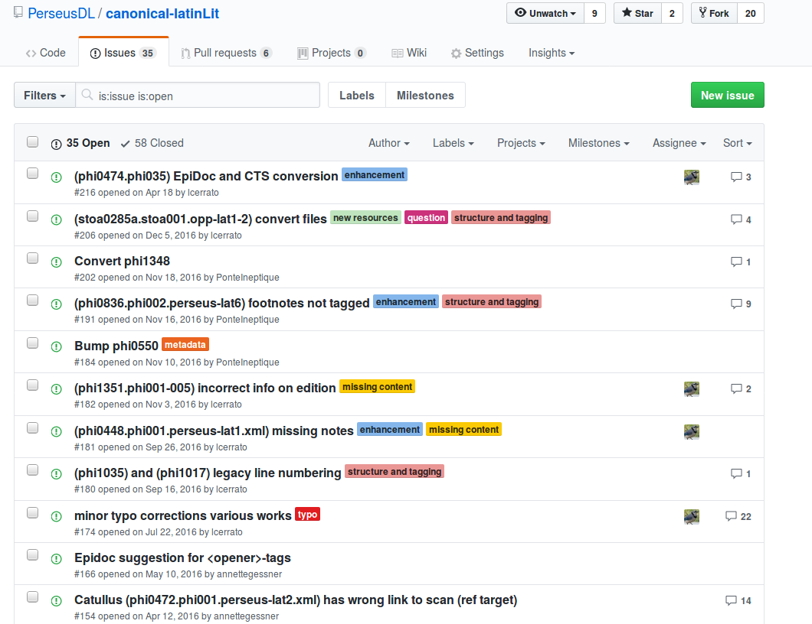
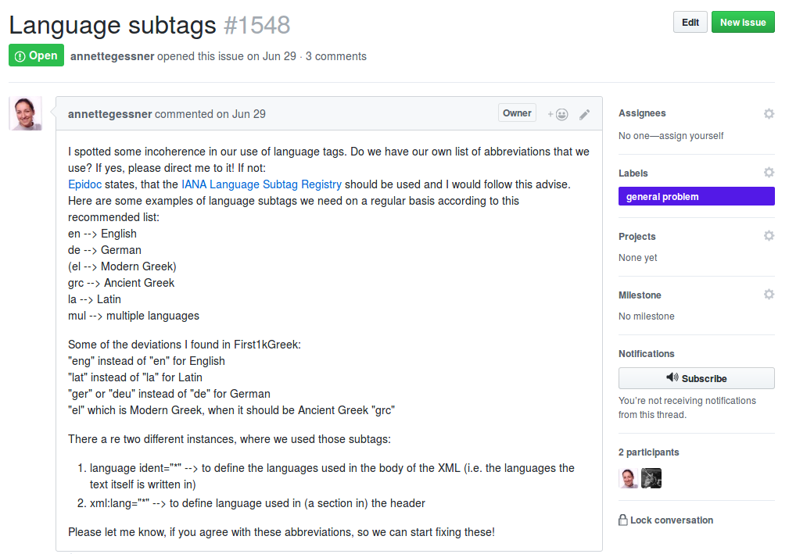
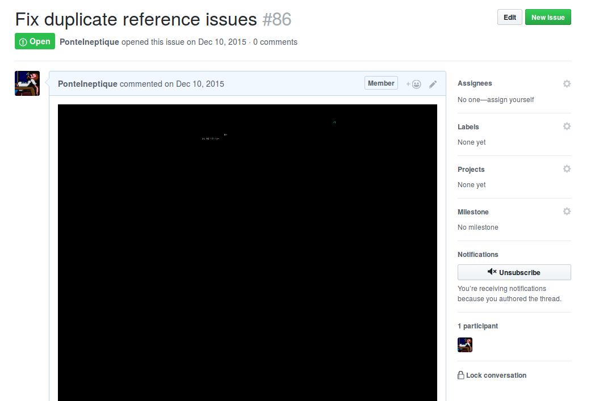

# 1. Github, gitlab, etc. : pourquoi ?

- Serveur distant
- Gestion d'équipe et de projets
	- Comptes utilisateurs
	- Comptes organisations
	- Équipes aux niveaux repository et organisations
- Gestion de bug et de tickets (Issues)
- Gestion de fusion de branche et de "review"

---

# 2. Github : les issues

- Un bug : on donne alors un titre au bug
	- si c'est dans le cadre d'un logiciel/d'une application/d'un site, on donne la démarche pour le reproduire 
	- on pense à donner les fichiers concernés par le bug
	- on essaye de décrire au mieux le problème. Même si c'est sur notre propre dépôt.
		- Sinon, on oublie le bug, on revient deux mois plus tard, on sait plus ce que c'est.

---

# 3. Github : les issues

- une nouveauté : on veut une nouvelle fonctionnalité, un nouvel ensemble de données
	- on décrit correctement ce que l'on veut, de manière à pouvoir transférer la charge ou s'en occuper soi-même plus tard
- une discussion : on essaye de comprendre un morceau de code, etc.

---

# 4. Github : les issues

- Les issues peuvent être **attribuées** à des membres du dépôt : si je travaille avec @vincentjolivet, et qu'un bug le concerne, je peux lui attribuer en tant que membre. Sinon, en voyant un bug qui me concerne, je peux me l'attribuer.
- Les issues peuvent avoir des **labels**. Une série de labels par défaut existe, mais on peut tout à fait en ajouter à ses propres dépôts.
- Les issues peuvent faire l'objet de regroupement dans des **projects** (sans deadline), des **milestones** (objectifs de sortie d'une nouvelle version).

---

# 5. Github : les issues d'un repo logiciel



---

# 6. Github : les issues d'un repo data



---

# 7. Github : un exemple de bonne issue

{height=60%}

---

# 8. Github : un exemple de mauvaise issue

{height=60%}

---

# 9. Les dépôts dérivés (forks)

- Les données de https://github.com/chartes/elec vous intéresse. Mais vous aimeriez changer une partie des données : ne conserver que les testaments de poilu et supprimer les éléments qui ne correspondent pas à vos besoins.
- À ce moment-là, on va réaliser un **fork** du repository sur son propre compte. On obtient ainsi les droits d'écritures sur le repository tout en gardant l'ensemble de son historique. On travaille sur ce repository ensuite localement, comme on travaillerait avec n'importe quel repository.
- **Note:** Si l'on fait des modifications sur un dépôt d'une autre personne, il est plus respectueux de faire un fork que de télécharger et de créer un nouveau dépôt.

---

# 10. Collaborer : les *pull requests*

- Une *pull request* (Vocabulaire de *github*) est une demande d'autorisation de contribution à un dépôt.
- Une pull request se fait entre deux branches, comme un merge. Cependant, cela peut être deux branches de deux forks.
- Contribuer à un repository ? 
	- Non seulement j'aide la personne et les utilisateurs du repository
	- Mais en plus j'apparais sur l'historique

---

# 11. Collaborer : les *pull requests* (Histoire exemple)

-  Je remarque une erreur dans les métadonnées d'un document
	1. J'ouvre une issue qui explique le problème (Typo dans le fichier X, etc.)
	2. Parce que je veux être encore plus utile, je veux proposer la modification pour que le propriétaire n'ait pas à faire la correction lui-même
	3. Je fais un fork du dépôt du cours ( https://github.com/ponteineptique/cours-git )
	4. Je crée une branche spécifique et je rentre dessus
		- Tips : quand on fait une branche pour un objectif particulier, on l'appelle du nom de l'issue pour se souvenir de pourquoi on a créé cette branche
	5. Je fais la modification et je la commit
	6. Je push
	7. Je fais une pull request sur le repository d'origine

---

# 12. Exercice

- Aller sur https://github.com/PonteIneptique/canonical-greekLit 
- Prendre un dossier auteur de https://github.com/PonteIneptique/canonical-greekLit/tree/master/data (Identifié par tlg**** )
- Dans ce dossier, ouvrir le fichier __cts__.xml
- Suivant les bonnes pratiques (issues, fork, pull request), proposer la traduction du nom de l'auteur
- **Bonus**: Ajouter l'identifiant Wikidata

```xml
...
<cpt:structured-metadata
        xmlns:cpt="http://purl.org/capitains/ns/1.0#"
        xmlns:dc="http://purl.org/dc/elements/1.1/">
<dc:identifier>https://www.wikidata.org/wiki/Q2098</dc:identifier>
</cpt:structured-metadata>
</ti:textgroup>
```