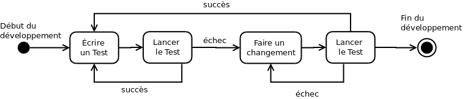
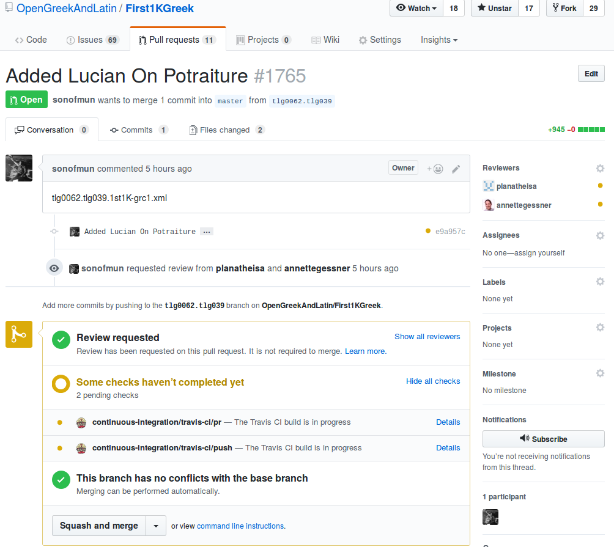

# 1. Question 

Quand on développe avec une équipe, quels risques encourons-nous ?

---

# 2. Réponses

- Quand on développe avec une équipe, quels risques encourons-nous ?
	- Introduction d'un bug par la modification d'un équipier
	- Modification du code qui passe inaperçue (Risque de duplication des efforts)
	- Erreur dans la manière de modifier le bug

---

# 3. Solutions

- Les *Pulls requests* règlent le problème du code qui passe inaperçu ou
- Les outils d'intégration continue règlent le problème des modifications et de l'introduction de bug

---

# 4. Principe

1. Vérifier à chaque modification que celle-ci n'entraîne pas de bug ou de régression
2. Vérification décentralisée et disponible pour l'ensemble de l'équipe
	- contrairement à une batterie de test local, tout le monde peut voir les résultats
3. Notification de l'ensemble de l'équipe en cas de problème ou de réussite
4. Un bug trouvé le plus tôt possible est un bug qui ne coûte pas cher.

---

# 5. Principe


---

# 6. Les tests

- Tous les langages de programmation avancés ont des logiciels de tests : php, python, java, etc.
- On distingue plusieurs types de test :
	- Les tests unitaires : on vérifie qu'un morceau de code particulier a un résultat particulier. Exemple : conjuguer(chanter, je, présent, indicatif): je chante.
	- Les tests d'intégrations : on vérifie qu'un ensemble de blocs fonctionne bien ensemble. Exemple : si je clique sur le bouton conjuguer, la fonction conjuguer est appelée et je vois le résultat,
	- etc..
- Écrire des tests représente une augmentation du temps de travail importante au départ. Cependant, un code testé vous signale tout de suite quand un changement opéré produit un problème. C'est une meilleure manière de découvrir un problème que d'avoir à cliquer sur tous les liens de toutes les pages de votre site.

---

# 7. Les tests

- Dans certains cas, on peut parler de TDD : Test Driven Development. 
	- Le principe : On écrit d'abord un test avant d'écrire la fonction.
	- Écrire le test veut dire que l'on est sûr de ce que l'on veut obtenir. C'est un moyen de se rendre compte de la limite de la compréhension de notre code ou de notre mission.
	- Lorsque j'écris un fichier XML avec un schéma prédéfini, je fais en fait une sorte de TDD. En soit, j'établis un résultat attend tel que TEI > text > body > div, et si je fais TEI > text > body > lg, une erreur est affichée.



---

# 8. Les outils : l'exemple de Travis

TravisCI (pour Travis Continuous Integration) est un outil partiellement gratuit qui permet de se connecter avec un dépôt github ou gitlab. En fonction d'une paramétrisation, il lancera l'ensemble des tests fournis et donnera un message.

Encore plus intéressant : en cas de pull request, il vous avertira avant de faire la fusion proposée par vos collègues, directement sur la page github.

---

# 9. Les outils : l'exemple de Travis 



---

# 10. Les outils : configurer Travis

Dans l'optique du projet, on utilisera la configuration suivante 


```shell
language: python

python:
  - '3.5'

install:
  - pip3 install HookTest>=1.0.0

script: hooktest ./ --scheme epidoc --workers 3 --verbose 10 --manifest --console table --countword

```
